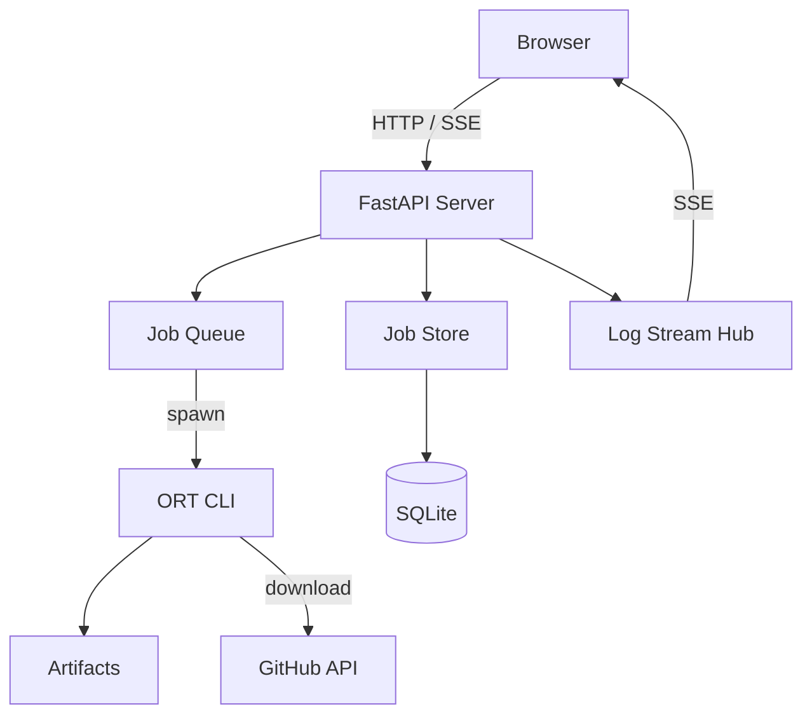
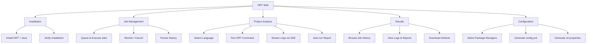
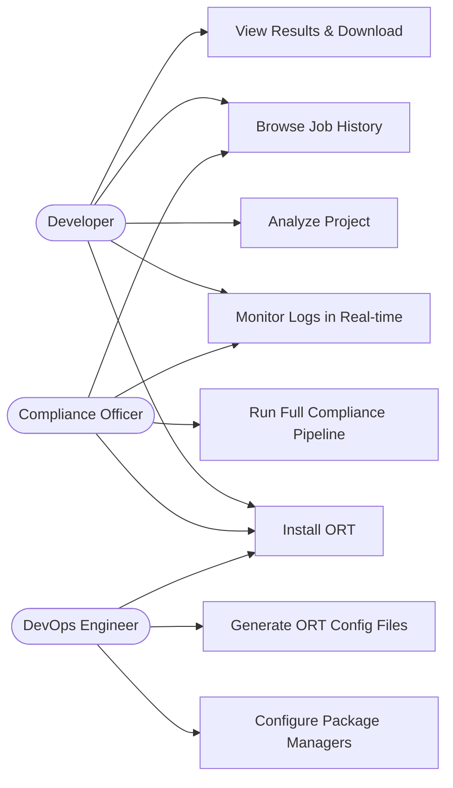
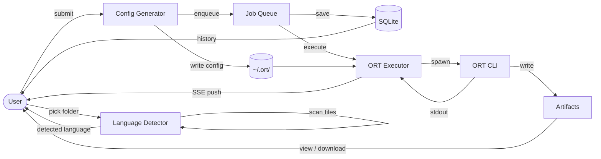

# ORT Web — System Diagrams

---

## 1. High Level Architecture

```mermaid
graph TB
    Browser["Browser"] -->|"HTTP / SSE"| API["FastAPI Server"]
    API --> JobQueue["Job Queue"]
    API --> JobStore["Job Store"]
    API --> LogHub["Log Stream Hub"]
    JobQueue -->|"spawn"| ORT["ORT CLI"]
    JobStore --> DB[("SQLite")]
    ORT --> Artifacts["Artifacts"]
    LogHub -->|"SSE"| Browser
    ORT -->|"download"| GitHub["GitHub API"]
```

---

## 2. Functional Decomposition

```mermaid
graph TB
    ORT["ORT Web"]

    ORT --> A["Installation"]
    ORT --> B["Job Management"]
    ORT --> C["Project Analysis"]
    ORT --> D["Results"]
    ORT --> E["Configuration"]

    A --> A1["Install ORT + Java"]
    A --> A2["Verify Installation"]

    B --> B1["Queue & Execute Jobs"]
    B --> B2["Monitor / Cancel"]
    B --> B3["Persist History"]

    C --> C1["Detect Language"]
    C --> C2["Run ORT Command"]
    C --> C3["Stream Logs via SSE"]
    C --> C4["Auto-run Report"]

    D --> D1["Browse Job History"]
    D --> D2["View Logs & Reports"]
    D --> D3["Download Artifacts"]

    E --> E1["Select Package Managers"]
    E --> E2["Generate config.yml"]
    E --> E3["Generate ort.properties"]
```

---

## 3. Use Case Diagram

```mermaid
flowchart LR
    Dev(["Developer"])
    CO(["Compliance Officer"])
    Ops(["DevOps Engineer"])

    Dev & CO & Ops --> Install["Install ORT"]

    Dev --> Analyze["Analyze Project"]
    Dev --> Monitor["Monitor Logs in Real-time"]
    Dev --> Results["View Results & Download"]
    Dev --> History["Browse Job History"]

    CO --> Pipeline["Run Full Compliance Pipeline"]
    CO --> Monitor
    CO --> History

    Ops --> Configure["Configure Package Managers"]
    Ops --> GenConfig["Generate ORT Config Files"]
```

---

## 4. Data Flow

```mermaid
flowchart LR
    User(["User"])

    User -->|"pick folder"| LD["Language Detector"]
    LD -->|"scan files"| LD
    LD -->|"detected language"| User

    User -->|"submit"| CG["Config Generator"]
    CG -->|"write config"| OrtCfg[("~/.ort/")]
    CG -->|"enqueue"| JQ["Job Queue"]

    JQ -->|"save"| DB[("SQLite")]
    JQ -->|"execute"| OE["ORT Executor"]
    OrtCfg --> OE
    OE -->|"spawn"| ORT["ORT CLI"]
    ORT -->|"stdout"| OE
    OE -->|"SSE push"| User
    ORT -->|"write"| ART["Artifacts"]

    DB -->|"history"| User
    ART -->|"view / download"| User
```
