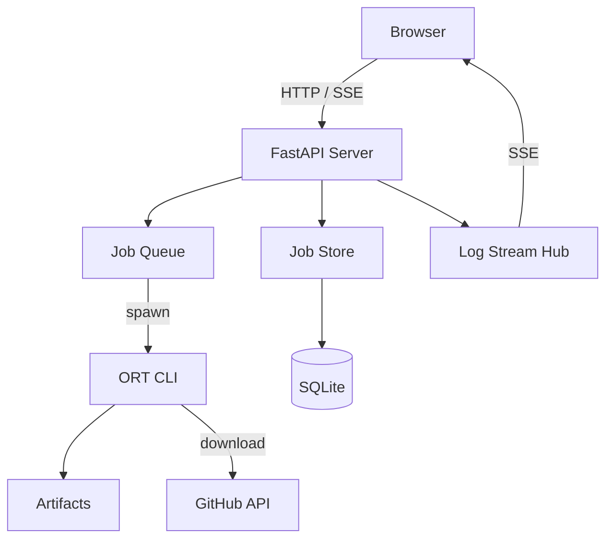
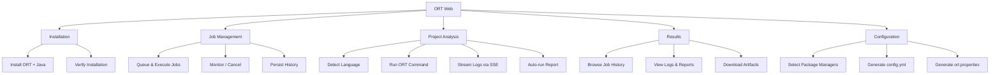
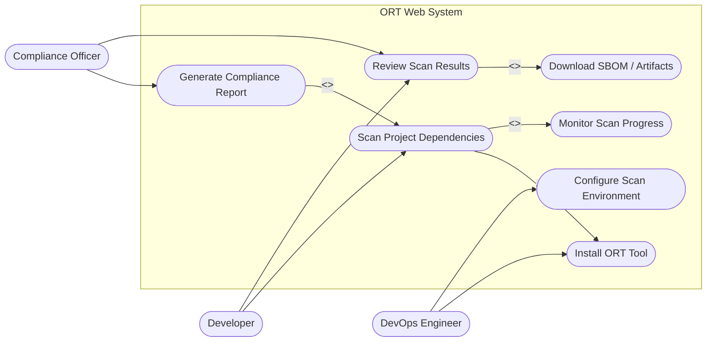

# ORT Web — System Diagrams

---

## 1. High Level Architecture

---

## 2. Functional Decomposition

---

## 3. Use Case Diagram

> Mô tả mục tiêu của từng actor khi tương tác với hệ thống. `<<include>>` = use case con bắt buộc phải chạy; `<<extend>>` = use case mở rộng tùy chọn.

---

## 4. Data Flow

