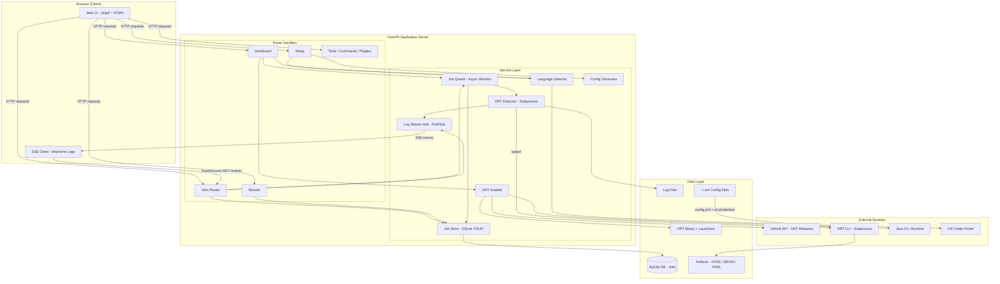
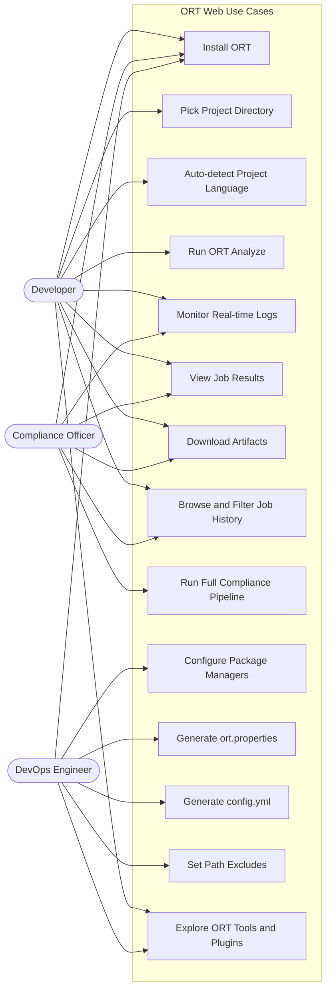
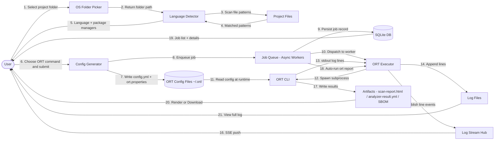

# ORT Web — System Diagrams

Tài liệu này tổng hợp 4 loại diagram mô tả kiến trúc và luồng hoạt động của hệ thống ORT Web.

---

## 1. High Level Architecture Diagram

> Mô tả tổng quan kiến trúc hệ thống: Browser → FastAPI Server → Data Layer → External Systems.

---

## 2. Functional Decomposition Diagram

> Phân rã hệ thống thành 6 nhóm chức năng chính và các sub-function tương ứng.

```mermaid
graph TB
    ORT["ORT Web System"]

    ORT --> IM["Installation Management"]
    ORT --> JM["Job Management"]
    ORT --> PA["Project Analysis"]
    ORT --> RM["Results Management"]
    ORT --> CM["Configuration Management"]
    ORT --> REF["Reference and Documentation"]

    IM --> IM1["Detect Java 21+"]
    IM --> IM2["Download ORT from GitHub"]
    IM --> IM3["Create Platform Launchers"]
    IM --> IM4["Verify ORT Installation"]

    JM --> JM1["Queue Jobs - Async Workers"]
    JM --> JM2["Execute Jobs - Subprocess"]
    JM --> JM3["Monitor Job Status"]
    JM --> JM4["Cancel Running Jobs"]
    JM --> JM5["Persist Job History - SQLite"]

    PA --> PA1["Pick Project Directory - OS Dialog"]
    PA --> PA2["Auto-detect Project Language"]
    PA --> PA3["Select ORT Command"]
    PA --> PA4["Stream Logs Real-time - SSE"]
    PA --> PA5["Auto-run Follow-up Reports"]

    RM --> RM1["Browse Job History"]
    RM --> RM2["Filter and Search Jobs"]
    RM --> RM3["View Raw Logs"]
    RM --> RM4["Render HTML Reports"]
    RM --> RM5["Download Artifacts"]

    CM --> CM1["Detect Package Managers - 18 Ecosystems"]
    CM --> CM2["Configure Enabled Managers"]
    CM --> CM3["Generate ort.properties"]
    CM --> CM4["Generate config.yml"]
    CM --> CM5["Set Repository Path Excludes"]

    REF --> REF1["ORT Core Tools Reference"]
    REF --> REF2["ORT Commands Reference"]
    REF --> REF3["ORT Plugins Explorer"]
```

---

## 3. Use Case Diagram

> Mô tả các actor và use case trong hệ thống: Developer, Compliance Officer, DevOps Engineer.

---

## 4. Data Flow Diagram

> Luồng dữ liệu từ đầu vào (user chọn folder) qua xử lý (Language Detection → Job Queue → ORT Executor) đến đầu ra (Artifacts, SSE logs, Job History).

