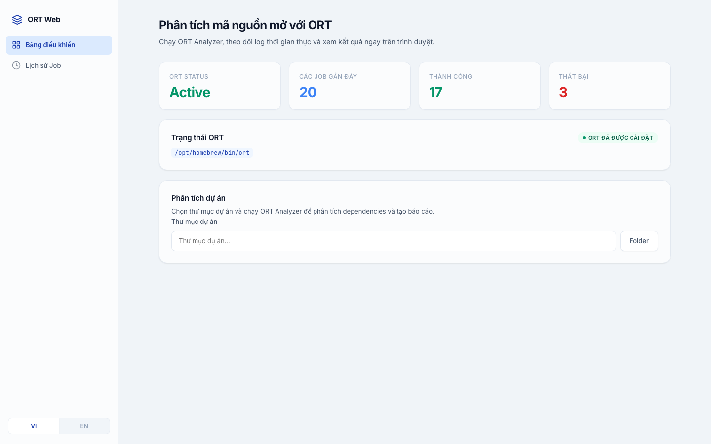
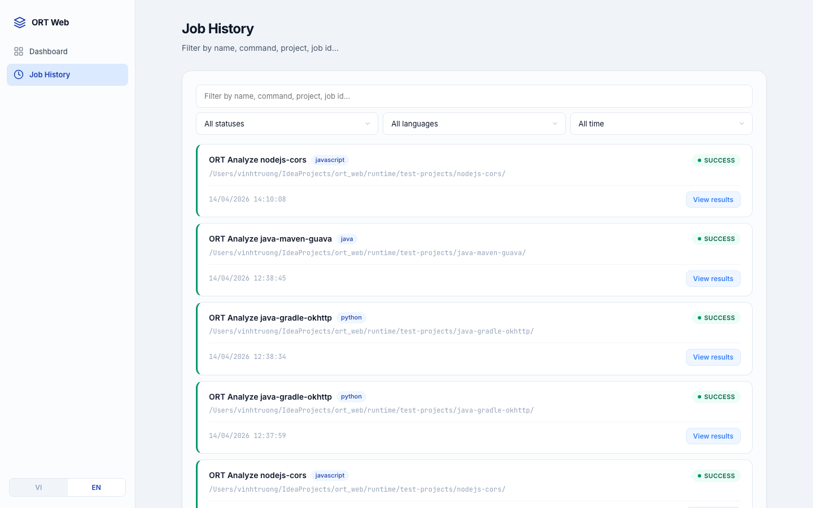
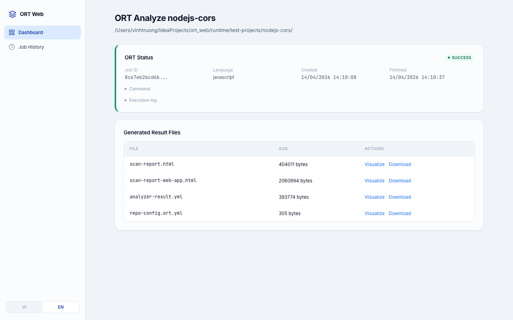

# OSS Guard

Local web GUI for [OSS Review Toolkit (ORT)](https://github.com/oss-review-toolkit/ort) — run ORT analyzer, stream logs in real-time, and browse results from your browser.


## Screenshots

| Dashboard | Job History | Job Detail |
|-----------|-------------|------------|
|  |  |  |

## Features

- **One-click ORT install** — download and install ORT directly from the UI
- **Auto language detection** — detects project language and auto-configures ORT
- **Real-time log streaming** — watch ORT output live via SSE
- **Job queue** — async job execution with parallel workers
- **HTML report generation** — auto-generates reports after analysis
- **Markdown report generation** — auto-generates `ort-report.md` with metadata, tags, vulnerabilities, and component inventory
- **Job history** — filter by status, language, time range with pagination
- **Bilingual UI** — Vietnamese and English
- **Modern SaaS UI** — glassmorphism design with sidebar navigation

## Prerequisites

| Requirement | Version | Notes |
|-------------|---------|-------|
| Python | 3.9+ | |
| Java | 21+ | Required by ORT |
| Git | any | For `oss-guard update` |

For Python project analysis, also install:

```bash
pip3 install python-inspector setuptools
```

The **Install ORT** flow verifies ScanCode's native `libmagic` dependency and
installs it automatically on macOS (Homebrew or MacPorts) and Windows (bundled
TypeCode plugin). On Linux, install it before running license scans:

```bash
# Ubuntu / Debian
sudo apt install libmagic1
```

If automatic installation cannot run on macOS, install Homebrew or MacPorts
first, or run `brew install libmagic` manually.

---

## Installation

### macOS

```bash
git clone https://github.com/tnvinh2711/ort-web.git
cd ort-web
python3 -m venv .venv
source .venv/bin/activate
pip3 install -e .
```

Create a global symlink so `oss-guard` works from anywhere:

```bash
# Apple Silicon (M1/M2/M3)
ln -sf "$PWD/.venv/bin/oss-guard" /opt/homebrew/bin/oss-guard

# Intel Mac
ln -sf "$PWD/.venv/bin/oss-guard" /usr/local/bin/oss-guard
```

### Linux

```bash
git clone https://github.com/tnvinh2711/ort-web.git
cd ort-web
python3 -m venv .venv
source .venv/bin/activate
pip3 install -e .
```

Create a global symlink:

```bash
ln -sf "$PWD/.venv/bin/oss-guard" ~/.local/bin/oss-guard
```

Make sure `~/.local/bin` is in your PATH (add to `~/.bashrc` or `~/.zshrc` if needed):

```bash
export PATH="$HOME/.local/bin:$PATH"
```

For the folder picker dialog on Linux, install one of:

```bash
sudo apt install zenity      # GNOME / Ubuntu
sudo dnf install zenity      # Fedora
sudo pacman -S kdialog       # KDE / Arch
```

### Windows

```cmd
git clone https://github.com/tnvinh2711/ort-web.git
cd ort-web
python -m venv .venv
.venv\Scripts\activate
pip3 install -e .
```

Run without activating venv using the included launcher:

```cmd
oss-guard.bat
```

Or add the venv Scripts folder to your PATH permanently:

1. Open **System Properties** → **Advanced** → **Environment Variables**
2. Under **User variables**, select `Path` → **Edit** → **New**
3. Add the full path to `.venv\Scripts` (e.g. `C:\Users\you\ort-web\.venv\Scripts`)
4. Click OK, restart terminal

Then run:

```cmd
oss-guard
```

---

## Running

### macOS / Linux

```bash
oss-guard                         # Start server + open browser
oss-guard open                    # Same as above
oss-guard open -p 3000            # Custom port
oss-guard open --reload           # Dev mode with auto-reload
oss-guard update                  # Check for new version + pull
oss-guard update -y               # Update without confirmation
oss-guard update --branch main    # Update from a specific branch
oss-guard version                 # Show current version
oss-guard -V                      # Short version flag
oss-guard generate-md             # Refresh Markdown report for the latest run
oss-guard generate-md --all       # Refresh Markdown reports for all runs
```

### Windows

```cmd
oss-guard.bat                    # Start server + open browser
oss-guard.bat open               # Same as above
oss-guard.bat open -p 3000       # Custom port
oss-guard.bat open --reload      # Dev mode with auto-reload
oss-guard.bat update             # Check for new version + pull
oss-guard.bat update -y          # Update without confirmation
oss-guard.bat version            # Show current version
```

If `oss-guard` is on your PATH (see Installation above):

```cmd
oss-guard open
oss-guard update
oss-guard version
```

---

## Updating

When a new version is tagged on GitHub:

```bash
oss-guard update
```

This will:
1. Check GitHub for the latest tag
2. `git fetch --tags` + `git checkout <tag>`
3. `pip install -e .` to install updated dependencies

---

## Usage

### Install ORT

On first launch, click **"Install ORT"** on the Dashboard. The installer downloads the latest ORT release from GitHub.

Default install locations:

| Platform | Path |
|----------|------|
| macOS (Apple Silicon) | `/opt/homebrew/bin` |
| macOS (Intel) | `/usr/local/bin` |
| Windows | `%LOCALAPPDATA%\Programs\ORT\bin` |
| Linux | `~/.local/bin` |

### Analyze a Project

1. Click **"Pick folder"** to select a project directory
2. Language is auto-detected (Python, Java, Go, Rust, Node.js, etc.)
3. Click **"Analyze"** to start

The analysis runs inline on the dashboard with realtime log streaming. Results appear when complete.

> **Note:** Folder picker on Linux requires `zenity` (GNOME) or `kdialog` (KDE) to be installed.

### Swift licenses

Swift manifests do not declare license metadata. For Swift projects OSS Guard therefore:

- runs ORT ScanCode automatically, then feeds `scan-result.yml` into OSV advice so detected licenses and vulnerabilities survive together in `advisor-result.yml`;
- resolves root and local `Package.swift` manifests so dependency source is available;
- runs a separate Trivy `license --license-full` pass without the vulnerability severity filter for both SwiftPM and Carthage projects, writing `trivy-license-result.json` and adding licenses to the existing Trivy Markdown/HTML reports.

Trivy scans source already present under the selected project only. An Xcode project containing only `.xcodeproj/.../Package.resolved` still gets vulnerability results, but may show zero licenses because lockfiles contain no license text. OSS Guard does not clone those remote pins automatically.

For Git worktrees, generated SwiftPM paths under `**/.build/**` are excluded
with `analyzer.skip_excluded: true`. Local first-party packages remain
analyzed, while dependency checkouts inside Swift's build cache are not
misidentified as projects of the parent repository.

### Gradle cache

Gradle wrapper distributions, Tooling API downloads, and dependencies are cached persistently in `runtime/.gradle`. Override the path with `ORT_WEB_GRADLE_USER_HOME`. The first run, changed wrapper versions, dynamic dependencies, toolchains, or refreshed metadata can still download; unchanged later runs reuse the cache. OSS Guard no longer runs a separate `runtimeClasspath` warm-up before ORT.

### Java runtime

The pre-flight check and ORT use the same Java runtime. Selection order is `ORT_WEB_JAVA_HOME`, a valid `JAVA_HOME`, then `java` on `PATH`. Set `ORT_WEB_JAVA_HOME` when OSS Guard must use a specific JDK without changing the rest of the machine. Java 21 LTS is preferred during automatic installation.

ORT runs with a 12 GiB maximum heap by default because large npm dependency
graphs can exceed the JVM's automatically selected heap. Override it with
`ORT_WEB_JAVA_MAX_HEAP` (for example, `ORT_WEB_JAVA_MAX_HEAP=8g`) when the
machine has a different memory budget. Analyze jobs do not run a redundant
Node.js project install before ORT; ORT resolves dependencies once and reuses
the persistent npm download cache under `runtime/.npm-cache`.

### Job History

Navigate to **"Job History"** in the sidebar to browse all past jobs with:
- Text search
- Status filter (success, failed, running, etc.)
- Language filter
- Time range (24h, 7d, 30d, 90d, custom)
- Pagination (10 per page)

Click **"View results"** on any job to see logs and generated files.

### Generated Markdown Reports

OSS Guard automatically generates a Markdown report after successful ORT report generation. The file is named `ort-report.md` and includes:
- Title, source, author, published, created, description, and tags
- Text sections for tags and summary
- Vulnerability table from ORT advisor results
- Component inventory from analyzer results

By default, Markdown reports are written to:

```text
runtime/markdown-reports/<job_id>/ort-report.md
```

The default folder is configured in source at `app/config.py`:

```python
# Example absolute path: DEFAULT_MARKDOWN_REPORTS_DIR = Path("/Users/your-user/ort-markdown-reports")
DEFAULT_MARKDOWN_REPORTS_DIR = Path("runtime") / "markdown-reports"
```

You can also override it at runtime:

```bash
ORT_WEB_MARKDOWN_REPORTS_DIR=/Users/your-user/ort-markdown-reports oss-guard open
```

Manual refresh commands are available when you need to regenerate reports from existing artifacts:

```bash
oss-guard generate-md
oss-guard generate-md --job-id <job_id>
oss-guard generate-md --all
oss-guard generate-md --output-dir /Users/your-user/ort-markdown-reports
```

---

## Platform Support

| Feature | macOS | Windows | Linux |
|---------|-------|---------|-------|
| Web server | ✅ | ✅ | ✅ |
| Install ORT | ✅ | ✅ | ✅ |
| Folder picker | ✅ native | ✅ PowerShell | ✅ zenity/kdialog |
| CLI launcher | `oss-guard` / `.sh` | `oss-guard.bat` | `oss-guard` / `.sh` |

---

## Tech Stack

| Layer | Technology |
|-------|-----------|
| Backend | FastAPI + Uvicorn |
| Frontend | HTMX + Jinja2 |
| Database | SQLite (job persistence) |
| Real-time | Server-Sent Events (SSE) |
| CLI | argparse |

## Supported Languages

| Language | Package Managers |
|----------|-----------------|
| Python | PIP, Poetry |
| Java / Kotlin | Gradle, Maven |
| JavaScript / TypeScript | NPM, PNPM, Yarn |
| Go | GoMod |
| Rust | Cargo |
| C# / .NET | DotNet |
| C / C++ | Conan |
| Ruby | Bundler |
| PHP | Composer |
| Swift | Swift PM |

## Project Structure

```
ort-web/
  app/
    cli.py             # CLI entry point (oss-guard command)
    _version.py        # Version string
    main.py            # FastAPI app
    config.py          # Settings
    models.py          # Job model
    i18n/              # Translations (vi, en)
    routers/           # Route handlers
    services/          # Business logic (queue, executor, installer)
    templates/         # Jinja2 HTML
    static/            # CSS, JS
  runtime/             # Logs, artifacts, SQLite (gitignored)
  oss-guard.sh         # Unix launcher (no venv activation needed)
  oss-guard.bat        # Windows launcher (no venv activation needed)
  ort-web.sh           # Legacy Unix launcher
  ort-web.bat          # Legacy Windows launcher
  ARCHITECTURE.md      # Detailed app flow documentation
  pyproject.toml       # Package config + CLI entry point
```

See [ARCHITECTURE.md](ARCHITECTURE.md) for detailed application flow.

## License

MIT
